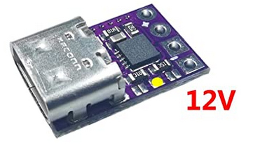

# The FreedomWing-PD Project	

## Introduction

The FreedomWing as designed and distributed by ATMakers.org and partners allows powerchair users to use the joystick on their chairs as an XBox controller. See more at [ATMakers.org](http://atmakers.org/freedomwing-build/). Their repo is [here](https://github.com/ATMakersOrg/FreedomWing/).

## The Problem

A 12V supply is required for operation. At the moment I don't know the current requirements of the joystick connection, just that some USB ports don't provide enough current for the Pololu (orig. design) or Microchip (SMD version) boost converters to support the load.

## My Solution

Well 2 ideas really. The first was to use Adafruit's USB-C PD 12V cable (#[5450](https://www.adafruit.com/product/5450)) to provide power, but they're out of stock.

The second idea is to use a little USB-C PD module and tack it onto the FreedomWing board. It looks like this: 

and comes from [Amazon](https://smile.amazon.com/gp/product/B08LDJBN8P). **You have to solder the pads shown to get the 12V output**.

It has a few advantages:

* You won't misplace your Adafruit cable and just jam something else in there to see if it works (or smokes).
* You don't need a decently regulated 12VDC adapter with enough guts to power the FreedomWing.
* You can just use a good USB-C PD phone charger and a decent USB-C cable. There won't be any shortage of these before long.

## Status

This mod has just been announced so we'll see where we go from here.

## Other Thoughts

I delved into the SMD boost converter version. My notes are [here](other/FreedomWing-SMD_Notes.md).

[Here](other/BatteryOperation.md) I consider the option of connecting (2) LiPo cells to the original Pololu board to remediate the deficiencies of USB 2.0 ports. Who knows, there could be FreedomWing-BAT design in the works someday.