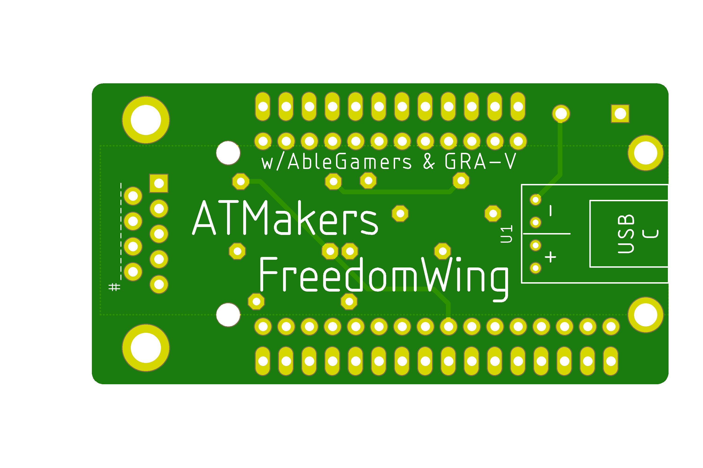
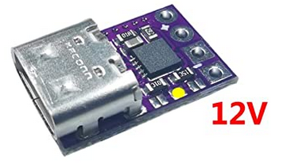

# The FreedomWing-PD Board

## The Mod

The USB-C PD [module](https://smile.amazon.com/gp/product/B08LDJBN8P) is small. I removed the Feather USB and BAT connections, and the Polulu boost converter. Since the Adafruit Feather is on top, I placed the PD module on the bottom of the FreedomWing board. Yeah, there's some work to be done to move some vias around to not stomp on the silkscreen, but we'll get there before the boards get fabricated.

And the schematic.

Prep the module by soldering the 12V pads as indicated:

That's it!