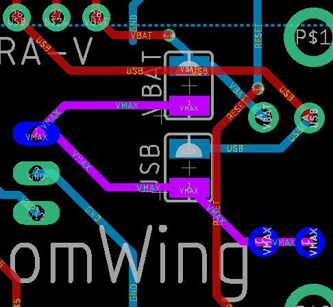

## Battery Operation with the Original Pololu Board

Use of a single 3.7V LiPo (Lithium Polymer pouch) cell is not beneficial. While not particularly current constrained, the lower voltage only yields just over 100mA of output current.

(2) LiPo cells in series will work with the Pololu module  (Vin ≤ Vout=12V) in the original board. This will yield better conversion efficiency and compensate for USB deficiencies. Plus offer some potential for wireless use.

The following considerations **must be noted**:

* the cells **cannot be charged** using the Feather's on-board charger as is. An adapter board could be made to allow the cells to be plugged in and placed in series with a 7.4V connection to the FW board. Then later disconnected and plugged into the Feather's battery connector.
* The pads for the USB and BAT cut/solder jumper **must be not be connected**. There can be no 7.4V backfeed into the USB cable, 3.3V voltage regulator, or Li-ion charger.
* The +7.4V lead can be connected to the node connecting the D1 or D2 cathode, Pololu pin1 (Vmax), or either of the lower BAT or USB pads ... i.e., what's in purple. The negative lead goes to GND.

**Cell charging could be implemented** with a DPDT relay (and more) to ping-pong between cells while monitoring their voltage on D9. There would be some software changes. This would also allow the Feather to be powered by either one of the LiPo cells for cordless operation while the cells in series power the joystick port.

I have not investigate all of the recommended Feather boards to confirm their compatibility with this scheme. I'll add a compatibility list if this becomes a thing.