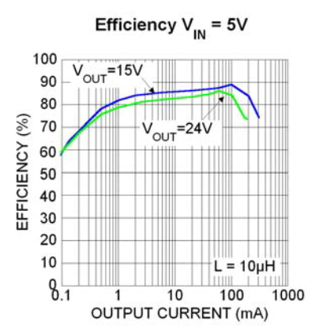
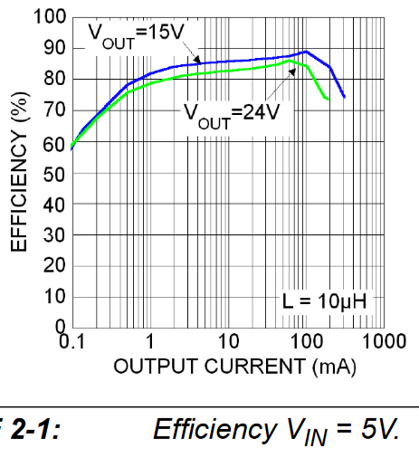

# FreedomWing-SMD Notes

## Prolog

The original design used a Pololu boost converter module #[2117](https://www.pololu.com/product/2117/) which is no longer available. The product graph show Iout=440mA with Vin=5V, Vout=12V. Max switching current is 1.4A but the product page text mentions switching up to 2A. (**?!**) My calculations yield a max output of about 350mA. Other larger, more capable modules are available from Pololu.

The FreedomWing-SMD design spec'd a Micrel/Microchip MIC2250 [boost converter](https://www.digikey.com/short/d4cq7db9) which is not currently in stock. The MIC2551 is in stock, but specs a 1.6A max switching current.

## Boost Converter Overview

### Microchip MIC2250-2YD5

Feedback voltage of 1.24V is spot on for 12V output.

The inductor model was not specified, 10µH.

**Boost Converter Specs**

|          Parameter           |     Value      | Notes |
| :--------------------------: | :------------: | ----- |
|             Vin              |   2.5-5.5 V    |       |
|  Switch Current Limit, Max   |      2.0A      |       |
|          Efficiency          |    80-90 %     |       |
| Under-voltage Lockout (UVLO) | < 1.8/2.0/2.4V |       |

**Iout Calculations**

| Parameter  |    Value    | Notes                                                        |
| :--------: | :---------: | ------------------------------------------------------------ |
|  Iin max   |    2.00A    | 140% of Iin avg per this [method](https://components101.com/articles/boost-converter-basics-working-design) |
|  Iin avg   |    1.43A    |                                                              |
|    Vin     |     5V      |                                                              |
|    Pin     |    7.14W    |                                                              |
| Efficiency |     74%     |                                                              |
|    Pout    |    5.29W    |                                                              |
|    Iout    |    440mA    | Should be slightly higher than for the Vin=5V, Vout=15V plot |
|            | 300mA **?** | per Vin=5V graph, 15Vout, 10uH (same as MIC2251 **?!**)      |

### Microchip MIC2251-1YD5

Available as of 2022-10-08.

**Boost Converter Specs**

|          Parameter           |     Value      | Notes |
| :--------------------------: | :------------: | ----- |
|             Vin              |   2.5-5.5 V    |       |
|  Switch Current Limit, Max   |      1.6A      |       |
|          Efficiency          |    80-90 %     |       |
| Under-voltage Lockout (UVLO) | < 1.8/2.0/2.4V |       |

**Iout Calculations**

| Parameter  | Value | Notes                                                        |
| :--------: | :---: | ------------------------------------------------------------ |
|  Iin max   | 1.60A | 140% of Iin avg per this [method](https://components101.com/articles/boost-converter-basics-working-design) |
|  Iin avg   | 1.14A |                                                              |
|    Vin     |  5V   |                                                              |
|    Pin     | 5.71W |                                                              |
| Efficiency |  74%  |                                                              |
|    Pout    | 4.23W |                                                              |
|    Iout    | 352mA | Should be slightly higher than for the Vin=5V, Vout=15V plot |
|            | 300mA | per Vin=5V graph, 15Vout, 10uH (**same as MIC2250 !?**)      |

## Joystick Output Voltage Divider

The joystick connector output voltage for the Horizontal, Vertical, and Reference signals. Each of these pass through a resistor network to reduce the voltage for compatibility with Feather inputs.

The resistor values of 100k and 47kΩ yield a voltage of **3.84V** to the input port with a 12.0V output from the joystick.

With an max input value of 3.3V, the joystick output should be no higher than **10.32V**.

## Conclusion

Older USB 2.0 and earlier ports only support a max output of 500mA at 5V, which is insufficient for this application. This may be the issue with the Hori Flex controller.

Newer Pololu modules may be suitable for an update to the original design, space permitting.

The Micrel/Microchip MIC225x converters seem to tap out at just over 300mA. The specs on the MIC 2250 seem to have been overstated. Vin is limited to 5.5V, so that excludes a 7.4V (2S) LiPo or 9V battery solution.